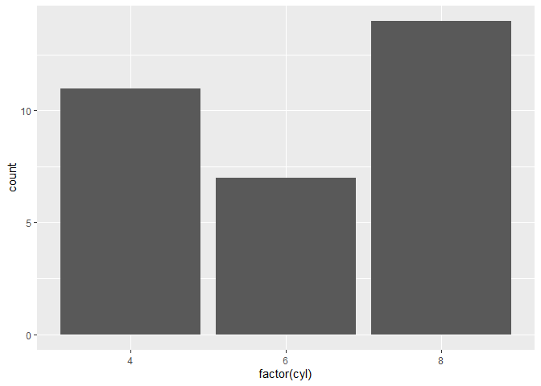

#This is plain text
Plain text

##This is smaller text
### This is even smaller text
Use insert to add a chunk of "R" code


```r
4*2
```

```
## [1] 8
```

```r
(7-2*5)/3
```

```
## [1] -1
```


```r
#install.packages("tidyverse")
library("tidyverse")
```

```r
ggplot(mtcars, aes(x = factor(cyl))) +
    geom_bar()
```

<!-- -->
