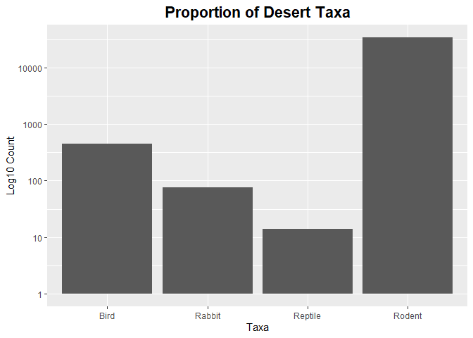

## Instructions
Answer the following questions and complete the exercises in RMarkdown. Please embed all of your code and push your final work to your repository. Your final lab report should be organized, clean, and run free from errors. Remember, you must remove the `#` for the included code chunks to run. Be sure to add your name to the author header above. For any included plots, make sure they are clearly labeled. You are free to use any plot type that you feel best communicates the results of your analysis.  

Make sure to use the formatting conventions of RMarkdown to make your report neat and clean!  

## Load the libraries

```r
library(tidyverse)
library(janitor)
library(here)
library(naniar)
```

## Desert Ecology
For this assignment, we are going to use a modified data set on [desert ecology](http://esapubs.org/archive/ecol/E090/118/). The data are from: S. K. Morgan Ernest, Thomas J. Valone, and James H. Brown. 2009. Long-term monitoring and experimental manipulation of a Chihuahuan Desert ecosystem near Portal, Arizona, USA. Ecology 90:1708.

```r
deserts <- read_csv(here("lab10", "data", "surveys_complete.csv"))
```

```
## 
## -- Column specification --------------------------------------------------------
## cols(
##   record_id = col_double(),
##   month = col_double(),
##   day = col_double(),
##   year = col_double(),
##   plot_id = col_double(),
##   species_id = col_character(),
##   sex = col_character(),
##   hindfoot_length = col_double(),
##   weight = col_double(),
##   genus = col_character(),
##   species = col_character(),
##   taxa = col_character(),
##   plot_type = col_character()
## )
```

1. Use the function(s) of your choice to get an idea of its structure, including how NA's are treated. Are the data tidy?  
No unusual/negative numbers, all NAs marked as "NA", names tidy, in wide format

```r
summary(deserts)
```

```
##    record_id         month             day            year         plot_id     
##  Min.   :    1   Min.   : 1.000   Min.   : 1.0   Min.   :1977   Min.   : 1.00  
##  1st Qu.: 8964   1st Qu.: 4.000   1st Qu.: 9.0   1st Qu.:1984   1st Qu.: 5.00  
##  Median :17762   Median : 6.000   Median :16.0   Median :1990   Median :11.00  
##  Mean   :17804   Mean   : 6.474   Mean   :16.1   Mean   :1990   Mean   :11.34  
##  3rd Qu.:26655   3rd Qu.:10.000   3rd Qu.:23.0   3rd Qu.:1997   3rd Qu.:17.00  
##  Max.   :35548   Max.   :12.000   Max.   :31.0   Max.   :2002   Max.   :24.00  
##                                                                                
##   species_id            sex            hindfoot_length     weight      
##  Length:34786       Length:34786       Min.   : 2.00   Min.   :  4.00  
##  Class :character   Class :character   1st Qu.:21.00   1st Qu.: 20.00  
##  Mode  :character   Mode  :character   Median :32.00   Median : 37.00  
##                                        Mean   :29.29   Mean   : 42.67  
##                                        3rd Qu.:36.00   3rd Qu.: 48.00  
##                                        Max.   :70.00   Max.   :280.00  
##                                        NA's   :3348    NA's   :2503    
##     genus             species              taxa            plot_type        
##  Length:34786       Length:34786       Length:34786       Length:34786      
##  Class :character   Class :character   Class :character   Class :character  
##  Mode  :character   Mode  :character   Mode  :character   Mode  :character  
##                                                                             
##                                                                             
##                                                                             
## 
```

```r
naniar::miss_var_summary(deserts)
```

```
## # A tibble: 13 x 3
##    variable        n_miss pct_miss
##    <chr>            <int>    <dbl>
##  1 hindfoot_length   3348     9.62
##  2 weight            2503     7.20
##  3 sex               1748     5.03
##  4 record_id            0     0   
##  5 month                0     0   
##  6 day                  0     0   
##  7 year                 0     0   
##  8 plot_id              0     0   
##  9 species_id           0     0   
## 10 genus                0     0   
## 11 species              0     0   
## 12 taxa                 0     0   
## 13 plot_type            0     0
```


2. How many genera and species are represented in the data? What are the total number of observations? Which species is most/ least frequently sampled in the study?


```r
deserts %>% 
  summarise(total_genera = n_distinct(genus), total_species = n_distinct(species), total_obsv = n())
```

```
## # A tibble: 1 x 3
##   total_genera total_species total_obsv
##          <int>         <int>      <int>
## 1           26            40      34786
```

The species merriami is sampled the most and there are six species tied for the least amount of sampling

```r
deserts %>% 
  count(species) %>% 
  filter(n == max(n) | n == min(n)) %>% 
  arrange(desc(n))
```

```
## # A tibble: 7 x 2
##   species          n
##   <chr>        <int>
## 1 merriami     10596
## 2 clarki           1
## 3 scutalatus       1
## 4 tereticaudus     1
## 5 tigris           1
## 6 uniparens        1
## 7 viridis          1
```


3. What is the proportion of taxa included in this study? Show a table and plot that reflects this count.


```r
deserts %>% 
  count(taxa)
```

```
## # A tibble: 4 x 2
##   taxa        n
## * <chr>   <int>
## 1 Bird      450
## 2 Rabbit     75
## 3 Reptile    14
## 4 Rodent  34247
```


```r
deserts %>% 
  ggplot(aes(x = taxa, fill = taxa))+
  geom_bar()+
  scale_y_log10()+
  labs(title = "Proportion of Desert Taxa", x = "Taxa", y = "Log10 Count")+
  theme(plot.title = element_text(size = rel(1.5), face = "bold", hjust = 0.5))
```

<!-- -->


4. For the taxa included in the study, use the fill option to show the proportion of individuals sampled by `plot_type.`


```r
deserts %>% 
  ggplot(aes(x = taxa, fill = plot_type))+
  geom_bar()+
  scale_y_log10()+
  labs(title = "Proportion of Desert Taxa", x = "Taxa", y = "Count")+
  theme(plot.title = element_text(size = rel(1.5), face = "bold", hjust = 0.5))
```

<!-- -->


5. What is the range of weight for each species included in the study? Remove any observations of weight that are NA so they do not show up in the plot.


```r
deserts %>% 
  filter(weight != "NA") %>% 
  group_by(species) %>% 
  summarise(mean_weight = mean(weight, na.rm = T), min_weight = min(weight,na.rm = T), max_weight = max(weight, na.rm = T))
```

```
## # A tibble: 22 x 4
##    species     mean_weight min_weight max_weight
##  * <chr>             <dbl>      <dbl>      <dbl>
##  1 albigula         159.           30        280
##  2 baileyi           31.7          12         55
##  3 eremicus          21.6           8         40
##  4 flavus             7.92          4         25
##  5 fulvescens        13.4           9         20
##  6 fulviventer       58.9          24        199
##  7 hispidus          65.6          16        140
##  8 intermedius       19.2          17         21
##  9 leucogaster       31.6          10         56
## 10 leucopus          19.1           8         27
## # ... with 12 more rows
```


```r
deserts %>% 
  filter(weight != "NA") %>% 
  ggplot(aes(x = species, y = weight))+
  geom_boxplot()+
  scale_y_log10()+
  labs(title = "Weight by Species in the Desert", x = "Species", y = "Log10 Weight")+
  theme(plot.title = element_text(size = rel(1.5), face = "bold", hjust = 0.5), axis.text.x = element_text(angle = 60, hjust = 1))
```

<!-- -->


6. Add another layer to your answer from #4 using `geom_point` to get an idea of how many measurements were taken for each species.


```r
deserts %>% 
  filter(weight != "NA") %>% 
  ggplot(aes(x = species, y = weight))+
  geom_boxplot()+
  geom_point(size = 0.5)+
  scale_y_log10()+
  labs(title = "Weight by Species in the Desert", x = "Species", y = "Log10 Weight")+
  theme(plot.title = element_text(size = rel(1.5), face = "bold", hjust = 0.5), axis.text.x = element_text(angle = 60, hjust = 1))
```

<!-- -->


7. [Dipodomys merriami](https://en.wikipedia.org/wiki/Merriam's_kangaroo_rat) is the most frequently sampled animal in the study. How have the number of observations of this species changed over the years included in the study?


```r
deserts %>% 
  select(species, year) %>% 
  filter(species == "merriami") %>% 
  group_by(year) %>% 
  summarise(total_obsv = n())
```

```
## # A tibble: 26 x 2
##     year total_obsv
##  * <dbl>      <int>
##  1  1977        264
##  2  1978        389
##  3  1979        209
##  4  1980        493
##  5  1981        559
##  6  1982        609
##  7  1983        528
##  8  1984        396
##  9  1985        667
## 10  1986        406
## # ... with 16 more rows
```


```r
deserts %>% 
  select(species, year) %>% 
  filter(species == "merriami") %>%
  ggplot(aes(x =year)) + 
  geom_bar()+
  labs(title = "Sampling of merriami 1977-2002", x = "Year", y = "Times Sampled")+
  theme(plot.title = element_text(size = rel(1.5), face = "bold", hjust = 0.5))
```

<!-- -->


8. What is the relationship between `weight` and `hindfoot` length? Consider whether or not over plotting is an issue.


```r
deserts %>% 
  ggplot(aes(x = weight, y = hindfoot_length))+
  geom_point(na.rm = T)+
  labs(title = "Weight vs. Hindfoot Length", x = "Weight", y = "Hindfoot Length")+
  theme(plot.title = element_text(size = rel(1.5), face = "bold", hjust = 0.5))
```

<!-- -->

Overplotting is an issue!

9. Which two species have, on average, the highest weight? Once you have identified them, make a new column that is a ratio of `weight` to `hindfoot_length`. Make a plot that shows the range of this new ratio and fill by sex.


```r
deserts %>% 
  group_by(species) %>% 
  summarise(mean_weight = mean(weight, na.rm = T)) %>% 
  arrange(desc(mean_weight))
```

```
## # A tibble: 40 x 2
##    species      mean_weight
##    <chr>              <dbl>
##  1 albigula           159. 
##  2 spectabilis        120. 
##  3 spilosoma           93.5
##  4 hispidus            65.6
##  5 fulviventer         58.9
##  6 ochrognathus        55.4
##  7 ordii               48.9
##  8 merriami            43.2
##  9 baileyi             31.7
## 10 leucogaster         31.6
## # ... with 30 more rows
```

Albigula and spectabilis have the highest weight on average


```r
desert_ratio <- deserts %>% 
  filter(weight != "NA", hindfoot_length != "NA") %>% 
  mutate("weight_to_hf_length" = weight/hindfoot_length)
```


```r
desert_ratio %>% 
  filter(sex != "NA") %>% 
  ggplot(aes(x = species, y = log10(weight_to_hf_length), fill = sex))+
  geom_boxplot()+
  labs(title = "Weight to Hindfoot Ratio by Sex and Species", x = "Species", y = "Log10 Weight to Hindfoot Length")+
  theme(plot.title = element_text(size = rel(1.5), face = "bold", hjust = 0.5), axis.text.x = element_text(angle = 60, hjust = 1))
```

<!-- -->


10. Make one plot of your choice! Make sure to include at least two of the aesthetics options you have learned.

How does sampling of different bird genuses vary throughout the months of the year?

```r
deserts %>% 
  filter(taxa == "Bird") %>%
  ggplot(aes(x = factor(month), fill = genus)) + 
  geom_bar()+
  labs(title = "Sampling of Birds 1980-2002", x = "Month", y = "Number of Samples")+
  theme(plot.title = element_text(size = rel(1.5), face = "bold", hjust = 0.5))
```

<!-- -->


## Push your final code to GitHub!
Please be sure that you check the `keep md` file in the knit preferences. 
