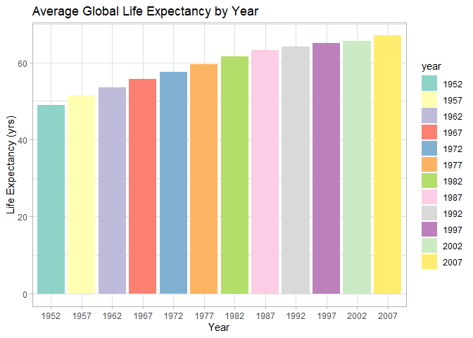
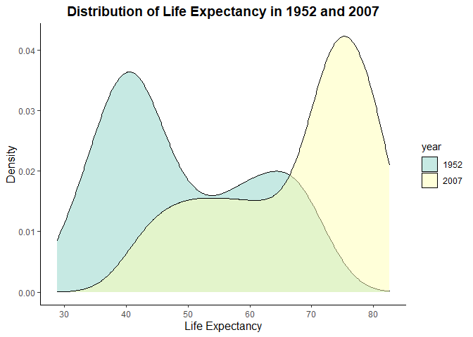
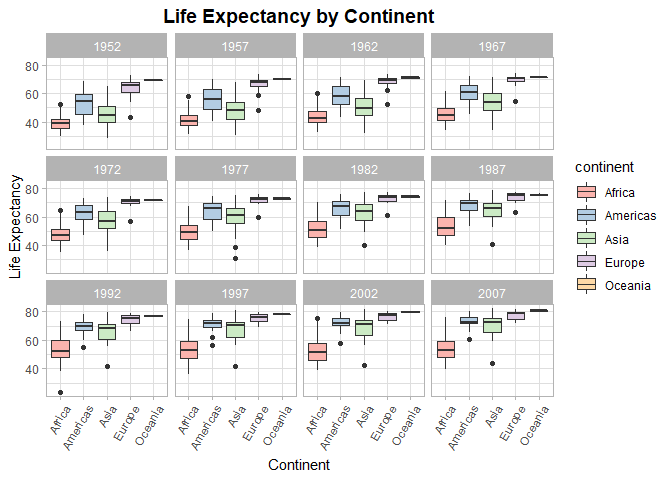
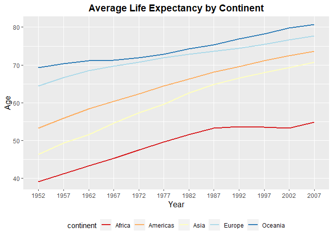
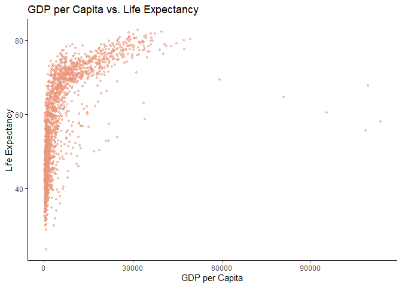
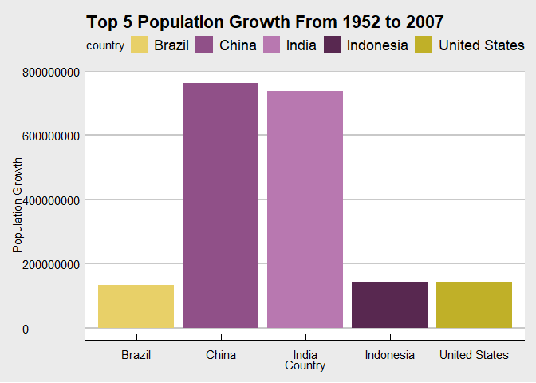
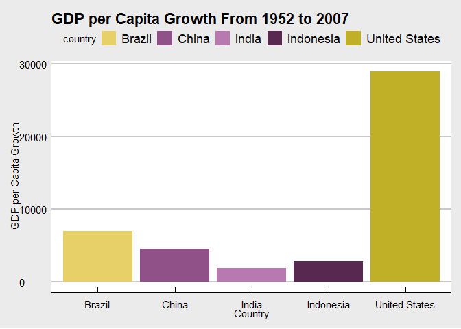
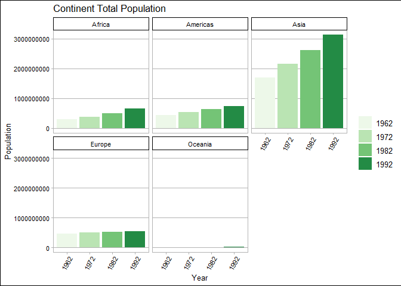

## Instructions
Answer the following questions and complete the exercises in RMarkdown. Please embed all of your code and push your final work to your repository. Your final lab report should be organized, clean, and run free from errors. Remember, you must remove the `#` for the included code chunks to run. Be sure to add your name to the author header above. For any included plots, make sure they are clearly labeled. You are free to use any plot type that you feel best communicates the results of your analysis.  

**In this homework, you should make use of the aesthetics you have learned. It's OK to be flashy!**

Make sure to use the formatting conventions of RMarkdown to make your report neat and clean!  

## Load the libraries

```r
library(tidyverse)
library(janitor)
library(here)
library(naniar)
library(ggthemes)
library(RColorBrewer)
```


```r
options(scipen=999)
```


## Resources
The idea for this assignment came from [Rebecca Barter's](http://www.rebeccabarter.com/blog/2017-11-17-ggplot2_tutorial/) ggplot tutorial so if you get stuck this is a good place to have a look.  

## Gapminder
For this assignment, we are going to use the dataset [gapminder](https://cran.r-project.org/web/packages/gapminder/index.html). Gapminder includes information about economics, population, and life expectancy from countries all over the world. You will need to install it before use. This is the same data that we will use for midterm 2 so this is good practice.

```r
#install.packages("gapminder")
library("gapminder")
```

## Questions
The questions below are open-ended and have many possible solutions. Your approach should, where appropriate, include numerical summaries and visuals. Be creative; assume you are building an analysis that you would ultimately present to an audience of stakeholders. Feel free to try out different `geoms` if they more clearly present your results.  

**1. Use the function(s) of your choice to get an idea of the overall structure of the data frame, including its dimensions, column names, variable classes, etc. As part of this, determine how NA's are treated in the data.**  


```r
summary(gapminder)
```

```
##         country        continent        year         lifeExp     
##  Afghanistan:  12   Africa  :624   Min.   :1952   Min.   :23.60  
##  Albania    :  12   Americas:300   1st Qu.:1966   1st Qu.:48.20  
##  Algeria    :  12   Asia    :396   Median :1980   Median :60.71  
##  Angola     :  12   Europe  :360   Mean   :1980   Mean   :59.47  
##  Argentina  :  12   Oceania : 24   3rd Qu.:1993   3rd Qu.:70.85  
##  Australia  :  12                  Max.   :2007   Max.   :82.60  
##  (Other)    :1632                                                
##       pop               gdpPercap       
##  Min.   :     60011   Min.   :   241.2  
##  1st Qu.:   2793664   1st Qu.:  1202.1  
##  Median :   7023596   Median :  3531.8  
##  Mean   :  29601212   Mean   :  7215.3  
##  3rd Qu.:  19585222   3rd Qu.:  9325.5  
##  Max.   :1318683096   Max.   :113523.1  
## 
```

```r
naniar::miss_var_summary(gapminder)
```

```
## # A tibble: 6 x 3
##   variable  n_miss pct_miss
##   <chr>      <int>    <dbl>
## 1 country        0        0
## 2 continent      0        0
## 3 year           0        0
## 4 lifeExp        0        0
## 5 pop            0        0
## 6 gdpPercap      0        0
```

```r
gapminder_tidy <- janitor::clean_names(gapminder)
```


```r
gapminder_tidy$year <- as.factor(gapminder_tidy$year)
```


**2. Among the interesting variables in gapminder is life expectancy. How has global life expectancy changed between 1952 and 2007?**


```r
gapminder_tidy %>% 
  group_by(year) %>% 
  summarise(mean_life_exp = mean(life_exp))
```

```
## # A tibble: 12 x 2
##    year  mean_life_exp
##  * <fct>         <dbl>
##  1 1952           49.1
##  2 1957           51.5
##  3 1962           53.6
##  4 1967           55.7
##  5 1972           57.6
##  6 1977           59.6
##  7 1982           61.5
##  8 1987           63.2
##  9 1992           64.2
## 10 1997           65.0
## 11 2002           65.7
## 12 2007           67.0
```


```r
gapminder_tidy %>% 
  group_by(year) %>% 
  summarise(mean_life_exp = mean(life_exp)) %>% 
  ggplot(aes(x = year, y = mean_life_exp, fill = year))+
  geom_col()+
  theme_light()+
  scale_fill_brewer(palette = "Set3")+
  labs(title = "Average Global Life Expectancy by Year", x = "Year", y = "Life Expectancy (yrs)")
```

<!-- -->


**3. How do the distributions of life expectancy compare for the years 1952 and 2007?**


```r
gapminder_tidy %>% 
  filter(year == 1952 | year == 2007) %>% 
  group_by(year) %>% 
  summarise(mean_life_exp = mean(life_exp), min_life_exp = min(life_exp), max_life_exp = max(life_exp))
```

```
## # A tibble: 2 x 4
##   year  mean_life_exp min_life_exp max_life_exp
## * <fct>         <dbl>        <dbl>        <dbl>
## 1 1952           49.1         28.8         72.7
## 2 2007           67.0         39.6         82.6
```


```r
gapminder_tidy %>% 
  filter(year == 1952 | year == 2007) %>% 
  ggplot(aes(x= life_exp, fill=year))+
  geom_density(alpha = 0.5)+
  scale_fill_brewer(palette = "Set3")+
  theme_classic()+
  labs(title = "Distribution of Life Expectancy in 1952 and 2007", x="Life Expectancy", y="Density")+
  theme(plot.title = element_text(size = 14, face = "bold", hjust = 0.5), axis.title = element_text(size=12))
```

<!-- -->


**4. Your answer above doesn't tell the whole story since life expectancy varies by region. Make a summary that shows the min, mean, and max life expectancy by continent for all years represented in the data.**


```r
gapminder_tidy %>% 
  group_by(continent, year) %>% 
  summarise(mean_le = mean(life_exp), min_le = min(life_exp), max_le = max(life_exp))
```

```
## `summarise()` has grouped output by 'continent'. You can override using the `.groups` argument.
```

```
## # A tibble: 60 x 5
## # Groups:   continent [5]
##    continent year  mean_le min_le max_le
##    <fct>     <fct>   <dbl>  <dbl>  <dbl>
##  1 Africa    1952     39.1   30     52.7
##  2 Africa    1957     41.3   31.6   58.1
##  3 Africa    1962     43.3   32.8   60.2
##  4 Africa    1967     45.3   34.1   61.6
##  5 Africa    1972     47.5   35.4   64.3
##  6 Africa    1977     49.6   36.8   67.1
##  7 Africa    1982     51.6   38.4   69.9
##  8 Africa    1987     53.3   39.9   71.9
##  9 Africa    1992     53.6   23.6   73.6
## 10 Africa    1997     53.6   36.1   74.8
## # ... with 50 more rows
```


```r
gapminder_tidy %>% 
  ggplot(aes(x = continent, y = life_exp, fill = continent))+
  geom_boxplot()+
  facet_wrap(~year)+
  scale_fill_brewer(palette = "Pastel1")+
  theme_light()+
  theme(plot.title = element_text(size = 14, face = "bold", hjust = 0.5), axis.text.x = element_text(angle = 60, hjust = 1))+
  labs(title = "Life Expectancy by Continent", x = "Continent", y = "Life Expectancy")
```

<!-- -->


**5. How has life expectancy changed between 1952-2007 for each continent?**


```r
gapminder_tidy %>%
  group_by(continent, year) %>% 
  summarise(mean_life_exp = mean(life_exp))
```

```
## `summarise()` has grouped output by 'continent'. You can override using the `.groups` argument.
```

```
## # A tibble: 60 x 3
## # Groups:   continent [5]
##    continent year  mean_life_exp
##    <fct>     <fct>         <dbl>
##  1 Africa    1952           39.1
##  2 Africa    1957           41.3
##  3 Africa    1962           43.3
##  4 Africa    1967           45.3
##  5 Africa    1972           47.5
##  6 Africa    1977           49.6
##  7 Africa    1982           51.6
##  8 Africa    1987           53.3
##  9 Africa    1992           53.6
## 10 Africa    1997           53.6
## # ... with 50 more rows
```


```r
gapminder_tidy %>%
  group_by(continent, year) %>% 
  summarise(mean_life_exp = mean(life_exp)) %>% 
  ggplot(aes(x=factor(year), y=mean_life_exp, group=continent, color=continent))+
  geom_line(size=1)+
  scale_colour_brewer(palette = "RdYlBu")+
  theme_gray()+
  labs(title = "Average Life Expectancy by Continent", x="Year", y="Age", fill= "Continent")+
  theme(plot.title = element_text(size = 14, face = "bold", hjust = 0.5), axis.title = element_text(size=12), legend.position = "bottom")
```

```
## `summarise()` has grouped output by 'continent'. You can override using the `.groups` argument.
```

<!-- -->


**6. We are interested in the relationship between per capita GDP and life expectancy; i.e. does having more money help you live longer?**


```r
gapminder_tidy %>% 
  ggplot(aes(x = gdp_percap, y = life_exp))+
  geom_point(color = "darksalmon", alpha = 0.5, size = 0.9)+
  labs(title = "GDP per Capita vs. Life Expectancy", x = "GDP per Capita", y = "Life Expectancy")+
  theme_classic()
```

<!-- -->


**7. Which countries have had the largest population growth since 1952?**


```r
gapminder_wide <- gapminder_tidy %>% 
  select(country, year, pop) %>% 
  filter(year == "1952" | year == "2007") %>% 
  pivot_wider(names_from = year, values_from = "pop" ) %>% 
  rename(beginning = "1952", end = "2007")
gapminder_wide
```

```
## # A tibble: 142 x 3
##    country     beginning       end
##    <fct>           <int>     <int>
##  1 Afghanistan   8425333  31889923
##  2 Albania       1282697   3600523
##  3 Algeria       9279525  33333216
##  4 Angola        4232095  12420476
##  5 Argentina    17876956  40301927
##  6 Australia     8691212  20434176
##  7 Austria       6927772   8199783
##  8 Bahrain        120447    708573
##  9 Bangladesh   46886859 150448339
## 10 Belgium       8730405  10392226
## # ... with 132 more rows
```


```r
gapminder_pop_growth <- gapminder_wide %>% 
  mutate(pop_growth = end - beginning) %>% 
  arrange(desc(pop_growth))
gapminder_pop_growth
```

```
## # A tibble: 142 x 4
##    country       beginning        end pop_growth
##    <fct>             <int>      <int>      <int>
##  1 China         556263527 1318683096  762419569
##  2 India         372000000 1110396331  738396331
##  3 United States 157553000  301139947  143586947
##  4 Indonesia      82052000  223547000  141495000
##  5 Brazil         56602560  190010647  133408087
##  6 Pakistan       41346560  169270617  127924057
##  7 Bangladesh     46886859  150448339  103561480
##  8 Nigeria        33119096  135031164  101912068
##  9 Mexico         30144317  108700891   78556574
## 10 Philippines    22438691   91077287   68638596
## # ... with 132 more rows
```


**8. Use your results from the question above to plot population growth for the top five countries since 1952.**


```r
colors <- paletteer::palettes_d_names
view(colors)
palette1 <- paletteer::paletteer_d("palettetown::koffing")
palette1
```

```
## <colors>
## #E8D068FF #905088FF #B878B0FF #582850FF #C0B028FF #D03820FF #D0C868FF #D898D0FF #F0E890FF #F8F8F8FF #F86048FF #D8D8D8FF
```


```r
gapminder_pop_growth %>% 
  top_n(5) %>% 
  ggplot(aes(x = country, y = pop_growth, fill = country))+
  geom_col()+
  scale_fill_manual(values = palette1)+
  theme_economist_white()+
  labs(title = "Top 5 Population Growth From 1952 to 2007", x = "Country", y = "Population Growth")
```

```
## Selecting by pop_growth
```

<!-- -->


**9. How does per-capita GDP growth compare between these same five countries?**


```r
gapminder_gdp_wide <- gapminder_tidy %>% 
  select(country, year, gdp_percap) %>% 
  filter(year == "1952" | year == "2007") %>% 
  pivot_wider(names_from = "year", values_from = "gdp_percap" ) %>% 
  rename(beginning = "1952", end = "2007")
gapminder_gdp_wide
```

```
## # A tibble: 142 x 3
##    country     beginning    end
##    <fct>           <dbl>  <dbl>
##  1 Afghanistan      779.   975.
##  2 Albania         1601.  5937.
##  3 Algeria         2449.  6223.
##  4 Angola          3521.  4797.
##  5 Argentina       5911. 12779.
##  6 Australia      10040. 34435.
##  7 Austria         6137. 36126.
##  8 Bahrain         9867. 29796.
##  9 Bangladesh       684.  1391.
## 10 Belgium         8343. 33693.
## # ... with 132 more rows
```


```r
gapminder_gdp_growth <- gapminder_gdp_wide %>% 
  mutate(gdp_growth = end - beginning) %>% 
  arrange(desc(gdp_growth))
gapminder_gdp_growth
```

```
## # A tibble: 142 x 4
##    country          beginning    end gdp_growth
##    <fct>                <dbl>  <dbl>      <dbl>
##  1 Singapore            2315. 47143.     44828.
##  2 Norway              10095. 49357.     39262.
##  3 Hong Kong, China     3054. 39725.     36671.
##  4 Ireland              5210. 40676.     35466.
##  5 Austria              6137. 36126.     29989.
##  6 United States       13990. 42952.     28961.
##  7 Iceland              7268. 36181.     28913.
##  8 Japan                3217. 31656.     28439.
##  9 Netherlands          8942. 36798.     27856.
## 10 Taiwan               1207. 28718.     27511.
## # ... with 132 more rows
```


```r
gapminder_gdp_growth %>% 
  filter(country == "China" | country == "India" | country == "Indonesia" | country == "United States" | country == "Brazil") %>% 
  ggplot(aes(x = country, y = gdp_growth, fill = country))+
  geom_col()+
  scale_fill_manual(values = palette1)+
  theme_economist_white()+
  labs(title = "GDP per Capita Growth From 1952 to 2007", x = "Country", y = "GDP per Capita Growth")
```

<!-- -->


**10. Make one plot of your choice that uses faceting!**

How does total continent populations change over the decades?

```r
gapminder_tidy %>% 
  select(continent, year, pop) %>% 
  filter(year == "1962" | year == "1972" | year == "1982" | year == "1992") %>% 
  group_by(continent, year) %>% 
  summarise(total_pop = sum(pop))
```

```
## `summarise()` has grouped output by 'continent'. You can override using the `.groups` argument.
```

```
## # A tibble: 20 x 3
## # Groups:   continent [5]
##    continent year   total_pop
##    <fct>     <fct>      <dbl>
##  1 Africa    1962   296516865
##  2 Africa    1972   379879541
##  3 Africa    1982   499348587
##  4 Africa    1992   659081517
##  5 Americas  1962   433270254
##  6 Americas  1972   529384210
##  7 Americas  1982   630290920
##  8 Americas  1992   739274104
##  9 Asia      1962  1696357182
## 10 Asia      1972  2150972248
## 11 Asia      1982  2610135582
## 12 Asia      1992  3133292191
## 13 Europe    1962   460355155
## 14 Europe    1972   500635059
## 15 Europe    1982   531266901
## 16 Europe    1992   558142797
## 17 Oceania   1962    13283518
## 18 Oceania   1972    16106100
## 19 Oceania   1982    18394850
## 20 Oceania   1992    20919651
```


```r
gapminder_tidy %>% 
  select(continent, year, pop) %>% 
  filter(year == "1962" | year == "1972" | year == "1982" | year == "1992") %>% 
  group_by(continent, year) %>% 
  summarise(total_pop = sum(pop)) %>%  
  ggplot(aes(x = year, y = total_pop, fill = year)) +
  geom_col()+
  scale_fill_brewer(palette = "dark2")+
  facet_wrap(~continent)+
  theme_calc()+
  theme(axis.text.x = element_text(angle = 60, hjust = 1))+
  labs(title = "Continent Total Population", x = "Year", y = "Population", fill = NULL)
```

```
## `summarise()` has grouped output by 'continent'. You can override using the `.groups` argument.
```

```
## Warning in pal_name(palette, type): Unknown palette dark2
```

<!-- -->
<style>
div.blue { background-color:#e6f0ff; border-radius: 5px; padding: 20px;}
</style>
<div class = "blue">


## Push your final code to GitHub!
Please be sure that you check the `keep md` file in the knit preferences.

</div>
