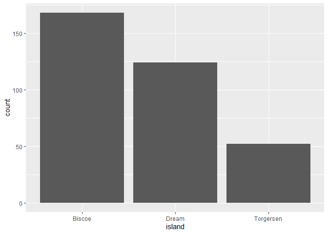
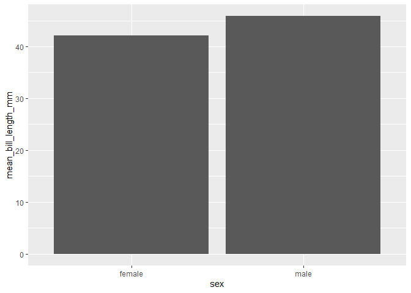
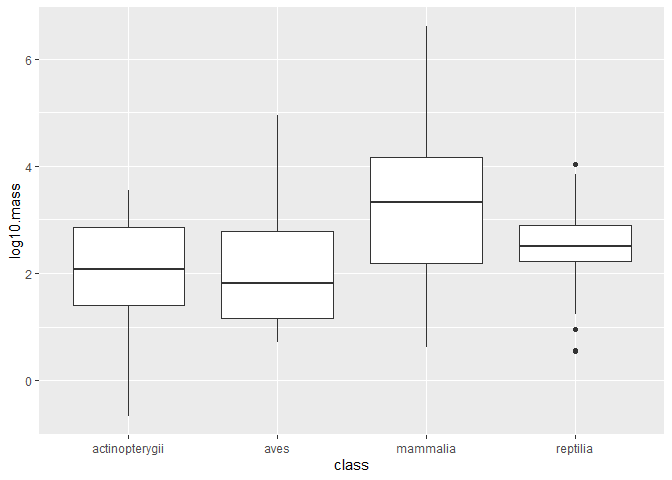
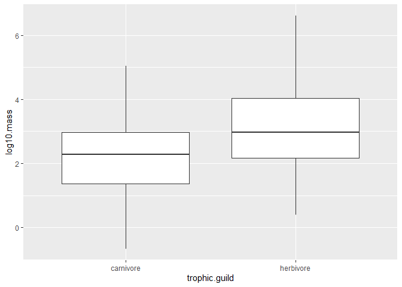
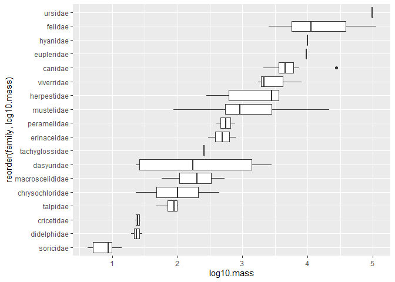

## Learning Goals
*At the end of this exercise, you will be able to:*    
1. Produce boxplots using `ggplot.`  
2. Customize labels on axes using `labs` and `themes`.  
3. Use `color`, `fill`, and `group` to customize plots and improve overall aesthetics.  

## Breakout Rooms  
Please take 5-8 minutes to check over your answers to HW 8 in your group. If you are stuck, please remember that you can check the key in [Joel's repository](https://github.com/jmledford3115/BIS15LW2021_jledford).  

##Resources
- [ggplot2 cheatsheet](https://www.rstudio.com/wp-content/uploads/2015/03/ggplot2-cheatsheet.pdf)
- [`ggplot` themes](https://ggplot2.tidyverse.org/reference/ggtheme.html)
- [Rebecca Barter `ggplot` Tutorial](http://www.rebeccabarter.com/blog/2017-11-17-ggplot2_tutorial/)

## Load the libraries

```r
library(tidyverse)
library(skimr)
library(janitor)
library(here)
library(palmerpenguins)
```

## Review
Now that you have been introduced to `ggplot`, let's practice a few more plot types. Remember that plots are built in layers: **plot= data + geom_ + aesthetics**. We have to specify each of these in order for a plot to be produced. If you get stuck, it is often helpful to stop and make a quick sketch of what you want or expect to see on a piece of scratch paper.  

Let's review using the `penguins` data. First, get an idea of the structure: Are the data tidy? Are there NA's? Are the variables discrete, categorical, or continuous?

```r
penguins
```

```
## # A tibble: 344 x 8
##    species island bill_length_mm bill_depth_mm flipper_length_~ body_mass_g
##    <fct>   <fct>           <dbl>         <dbl>            <int>       <int>
##  1 Adelie  Torge~           39.1          18.7              181        3750
##  2 Adelie  Torge~           39.5          17.4              186        3800
##  3 Adelie  Torge~           40.3          18                195        3250
##  4 Adelie  Torge~           NA            NA                 NA          NA
##  5 Adelie  Torge~           36.7          19.3              193        3450
##  6 Adelie  Torge~           39.3          20.6              190        3650
##  7 Adelie  Torge~           38.9          17.8              181        3625
##  8 Adelie  Torge~           39.2          19.6              195        4675
##  9 Adelie  Torge~           34.1          18.1              193        3475
## 10 Adelie  Torge~           42            20.2              190        4250
## # ... with 334 more rows, and 2 more variables: sex <fct>, year <int>
```

In a previous lab, we asked how many penguins are on each island.

```r
penguins %>% count(island, species, sort = F)
```

```
## # A tibble: 5 x 3
##   island    species       n
##   <fct>     <fct>     <int>
## 1 Biscoe    Adelie       44
## 2 Biscoe    Gentoo      124
## 3 Dream     Adelie       56
## 4 Dream     Chinstrap    68
## 5 Torgersen Adelie       52
```

What if we wanted a plot that showed the number of measured penguins per species and the number of measured penguins per island?

```r
penguins %>%
  group_by(species) %>% 
  ggplot(aes(x=species)) + 
  geom_bar()
```

<!-- -->


```r
penguins %>%
  group_by(island) %>% 
  ggplot(aes(x=island)) + 
  geom_bar()
```

<!-- -->

How about average bill length by sex?

```r
penguins %>%
  group_by(sex) %>%
  filter(!is.na(sex)) %>% 
  summarise(mean_bill_length_mm = mean(bill_length_mm, na.rm = T))
```

```
## # A tibble: 2 x 2
##   sex    mean_bill_length_mm
##   <fct>                <dbl>
## 1 female                42.1
## 2 male                  45.9
```


```r
penguins %>%
  group_by(sex) %>%
  filter(!is.na(sex)) %>% 
  summarise(mean_bill_length_mm = mean(bill_length_mm, na.rm = T)) %>% 
  ggplot(aes(x = sex, y = mean_bill_length_mm)) +
  geom_col()
```

<!-- -->

## Box Plots
For the next series of examples, we will use the `homerange` data.  **Database of vertebrate home range sizes.**   

Reference: Tamburello N, Cote IM, Dulvy NK (2015) Energy and the scaling of animal space use. The American Naturalist 186(2):196-211. http://dx.doi.org/10.1086/682070.  
Data: http://datadryad.org/resource/doi:10.5061/dryad.q5j65/1  


```r
homerange <- read_csv(here("lab9", "data", "Tamburelloetal_HomeRangeDatabase.csv"))
homerange
```

```
## # A tibble: 569 x 24
##    taxon common.name class order family genus species primarymethod N    
##    <chr> <chr>       <chr> <chr> <chr>  <chr> <chr>   <chr>         <chr>
##  1 lake~ american e~ acti~ angu~ angui~ angu~ rostra~ telemetry     16   
##  2 rive~ blacktail ~ acti~ cypr~ catos~ moxo~ poecil~ mark-recaptu~ <NA> 
##  3 rive~ central st~ acti~ cypr~ cypri~ camp~ anomal~ mark-recaptu~ 20   
##  4 rive~ rosyside d~ acti~ cypr~ cypri~ clin~ fundul~ mark-recaptu~ 26   
##  5 rive~ longnose d~ acti~ cypr~ cypri~ rhin~ catara~ mark-recaptu~ 17   
##  6 rive~ muskellunge acti~ esoc~ esoci~ esox  masqui~ telemetry     5    
##  7 mari~ pollack     acti~ gadi~ gadid~ poll~ pollac~ telemetry     2    
##  8 mari~ saithe      acti~ gadi~ gadid~ poll~ virens  telemetry     2    
##  9 mari~ lined surg~ acti~ perc~ acant~ acan~ lineat~ direct obser~ <NA> 
## 10 mari~ orangespin~ acti~ perc~ acant~ naso  litura~ telemetry     8    
## # ... with 559 more rows, and 15 more variables: mean.mass.g <dbl>,
## #   log10.mass <dbl>, alternative.mass.reference <chr>, mean.hra.m2 <dbl>,
## #   log10.hra <dbl>, hra.reference <chr>, realm <chr>, thermoregulation <chr>,
## #   locomotion <chr>, trophic.guild <chr>, dimension <chr>, preymass <dbl>,
## #   log10.preymass <dbl>, PPMR <dbl>, prey.size.reference <chr>
```

Boxplots help us visualize a range of values. So, on the x-axis we typically have something categorical and the y-axis is the range. In the case below, we are plotting `log10.mass` by taxonomic class in the `homerange` data. `geom_boxplot()` is the geom type for a standard box plot. The center line in each box represents the median, not the mean.

Let's look at the variable `log10.mass` grouped by taxonomic class.

```r
homerange %>% 
  group_by(class) %>% 
  summarize(min_log10.mass=min(log10.mass),
            max_log10.mass=max(log10.mass),
            median_log10.mass=median(log10.mass))
```

```
## # A tibble: 4 x 4
##   class          min_log10.mass max_log10.mass median_log10.mass
## * <chr>                   <dbl>          <dbl>             <dbl>
## 1 actinopterygii         -0.658           3.55              2.08
## 2 aves                    0.712           4.95              1.82
## 3 mammalia                0.620           6.60              3.33
## 4 reptilia                0.539           4.03              2.51
```


```r
homerange %>% 
  ggplot(aes(x = class, y = log10.mass)) +
  geom_boxplot()
```

<!-- -->

## Practice
1. There are more herbivores than carnivores in the homerange data, but how do their masses compare? Make a summary and boxplot that compares their masses. Use `log10.mass`.

```r
homerange %>% 
  group_by(trophic.guild) %>% 
  summarise(min_log10.mass = min(log10.mass), max_log10.mass = max(log10.mass), median_log10.mass = mean(log10.mass))
```

```
## # A tibble: 2 x 4
##   trophic.guild min_log10.mass max_log10.mass median_log10.mass
## * <chr>                  <dbl>          <dbl>             <dbl>
## 1 carnivore             -0.658           5.05              2.24
## 2 herbivore              0.398           6.60              3.13
```


```r
homerange %>% 
  ggplot(aes(x=trophic.guild, y=log10.mass))+
  geom_boxplot()
```

<!-- -->

2. Have a closer look at carnivorous mammals. Summarize and visualize the range of log10.mass by family.

```r
homerange %>% 
  filter(trophic.guild == "carnivore", class == "mammalia") %>% 
  group_by(family) %>% 
  summarise(min_log10.mass = min(log10.mass), max_log10.mass = max(log10.mass), median_log10.mass = mean(log10.mass))
```

```
## # A tibble: 18 x 4
##    family          min_log10.mass max_log10.mass median_log10.mass
##  * <chr>                    <dbl>          <dbl>             <dbl>
##  1 canidae                  3.32            4.44             3.73 
##  2 chrysochloridae          1.36            2.64             2.00 
##  3 cricetidae               1.34            1.44             1.39 
##  4 dasyuridae               1.36            3.45             2.32 
##  5 didelphidae              1.29            1.46             1.38 
##  6 erinaceidae              2.47            2.90             2.69 
##  7 eupleridae               3.98            3.98             3.98 
##  8 felidae                  3.40            5.05             4.16 
##  9 herpestidae              2.45            3.56             3.16 
## 10 hyanidae                 4               4                4    
## 11 macroscelididae          1.76            2.73             2.27 
## 12 mustelidae               1.94            4.33             3.08 
## 13 peramelidae              2.59            2.89             2.74 
## 14 soricidae                0.620           1.15             0.882
## 15 tachyglossidae           2.41            2.41             2.41 
## 16 talpidae                 1.68            2.01             1.90 
## 17 ursidae                  4.99            4.99             4.99 
## 18 viverridae               3.24            3.90             3.49
```

3. Now use a boxplot to visualize the range of body mass by family of carnivore.

```r
homerange %>% 
  filter(trophic.guild == "carnivore", class == "mammalia") %>%
  ggplot(aes(x= reorder(family, log10.mass), y=log10.mass)) +
  geom_boxplot()+
  coord_flip()
```

<!-- -->

## That's it, let's take a break!   

-->[Home](https://jmledford3115.github.io/datascibiol/)
